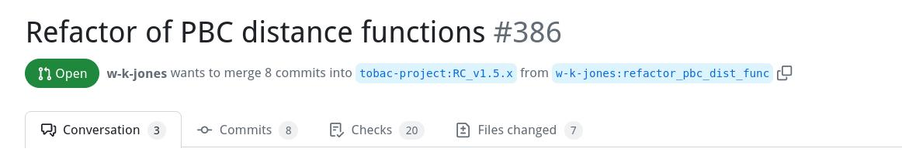

# Realcase Testing for Tobac

This is a tool for **realcase testing** of tobac developments. 

For this, the tool:
- creates reference data files using the example Jupyter notebooks from one selected [tobac](https://github.com/tobac-project/tobac) version and
- creates a 2nd set of data files via the examples from a 2nd *tobac* version


It works by creating a Mamba environment and installing certain checkpoints of tobac that are then used to locally run example notebooks. The resulting .h5 and .nc files are then compared on a per variable/attribute basis. The comparison result is output to the terminal.


## INSTALLATION

1. Clone the repository
2. Make sure Mamba is installed

## USAGE AND OPTIONS

1. Open the repository folder in your terminal
2. Run `python realcase_testing.py` with your arguments

### Options:

Example call: `python ./realcase_testing.py -nb v1.5.2 -v1 1.5.2 -v2 v1.5.1 -s ./realcase_testing`

| Argument        | Function                                                                                                                                                         | Possibilities                                                          |
|-----------------|------------------------------------------------------------------------------------------------------------------------------------------------------------------|------------------------------------------------------------------------|
| -nb, --notebook | For specifying the checkpoint for the notebooks. You may use the current working directory, an absolute/relative path to a directory or a GitHub version or hash | wd, ./examples, v1.5.2/1.5.2, 8f92d8030e9e402a1fc295bacfc703d9f6955498 |
| -v1, --version1 | First tobac version for comparison                                                                                                                               | v1.5.2/1.5.2, v1.5.1/1.5.1, ...                                        |
| -v2, --version2 | Second tobac version for comparison                                                                                                                              | v1.5.2/1.5.2, v1.5.1/1.5.1, ...                                        |
| -v1u, --version1url | URL of the git Repo that hosts version 1 | https://github.com/tobac-project/tobac.git or any other fork|
| -v2u, --version1url | URL of the git Repo that hosts version 2 | https://github.com/tobac-project/tobac.git or any other fork|
| -s,  --save     | The directory in which the environment and reference data should be saved. Either a directory in /tmp or a specified relative/absolute path                      | tmp, ./realcase_testing                                                |
| -na,  --names    | For choosing specific notebooks to test                                                                                                                          | [Example_OLR_Tracking_model, Example_Precip_Tracking]                  |

## FURTHER EXAMPLES

### Using Realcase Testing for Pull Requests

We consider a certain github pull request. This one: https://github.com/tobac-project/tobac/pull/386




In this PR, we have
- "tobac-project:RC_v.1.x" as *target* branch and 
- "w-k-jones:refactor_pbc_dist_func" as *base* branch

At the current stage of the PR,  
- the *target* is pointing to commit hash: "2fe56c08928208bdd5416fc4f3ee560a3329b8f9"
- and the *base* is pointing to commit hash: "319d7a36ab1231594aac99b07a8e39c9c6e8ffe3"

This may change as the PR evolves....

So, we select the following **choices for options**:
- notebooks from the target branch - option: `-nb 2fe56c08928208bdd5416fc4f3ee560a3329b8f9` 
- version 1 from the target branch - option: `-v1 2fe56c08928208bdd5416fc4f3ee560a3329b8f9` 
- version 2 from the base branch - option: `-v2 319d7a36ab1231594aac99b07a8e39c9c6e8ffe3`
- and because the base comes from a fork we need to provide the URL - option: `-v2u https://github.com/w-k-jones/tobac.git` 

Hence, the combined call of the realcase testing utility is:

```bash
python ./realcase_testing.py \
    -nb 2fe56c08928208bdd5416fc4f3ee560a3329b8f9 \
    -v1 2fe56c08928208bdd5416fc4f3ee560a3329b8f9 \
    -v2 319d7a36ab1231594aac99b07a8e39c9c6e8ffe3 \
    -v2u https://github.com/w-k-jones/tobac.git \
    -s ./testing_PR386
```


